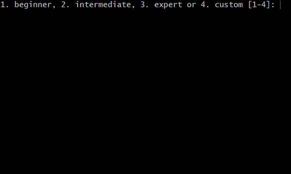

# Minesweeper
Minesweeper

## Installation and Usage
Clone the repository by pasting "`git clone https://github.com/janettem/Minesweeper.git Minesweeper`" to your terminal. Then, move to the directory: `cd Minesweeper`. Then, compile the program: `make`. Now, you can execute the program: `./minesweeper`.
